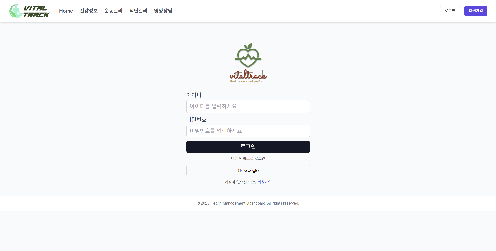
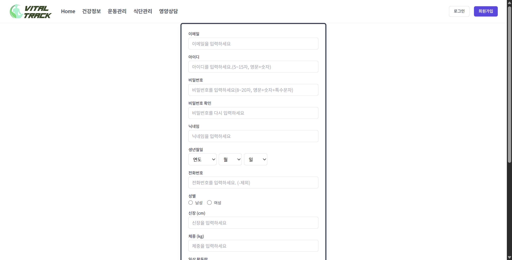
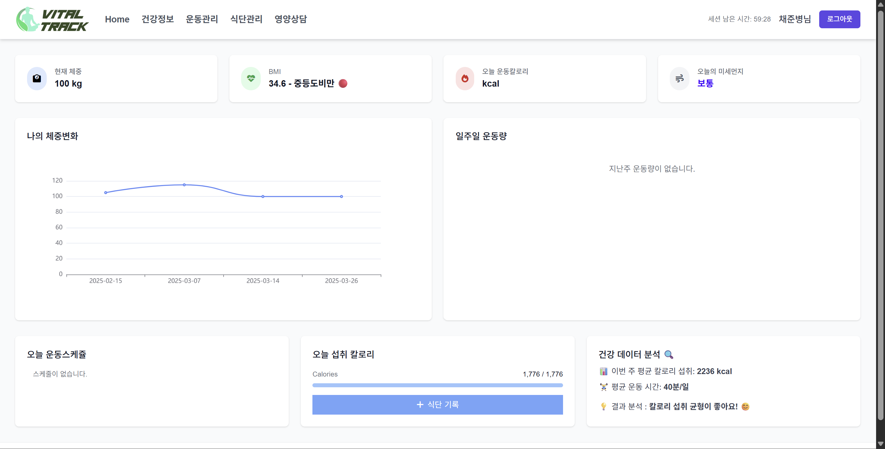
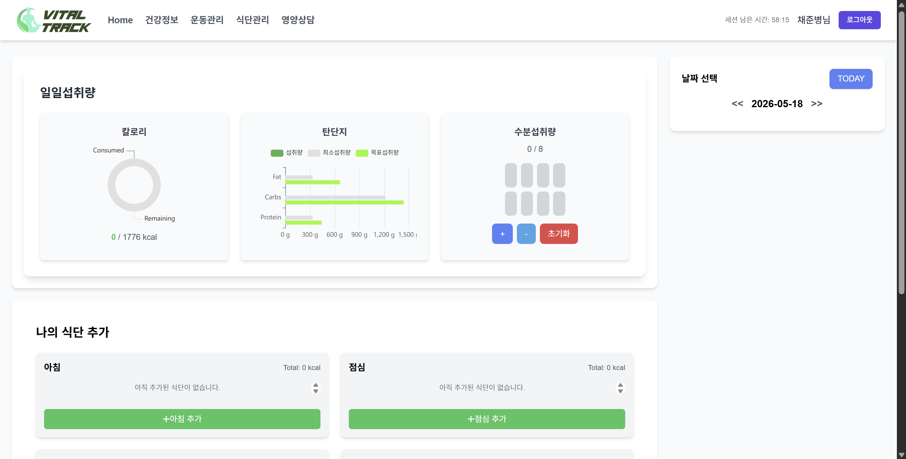
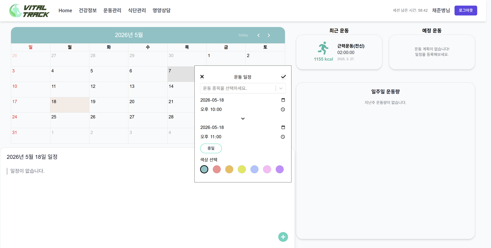
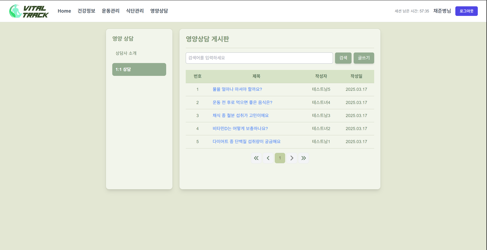
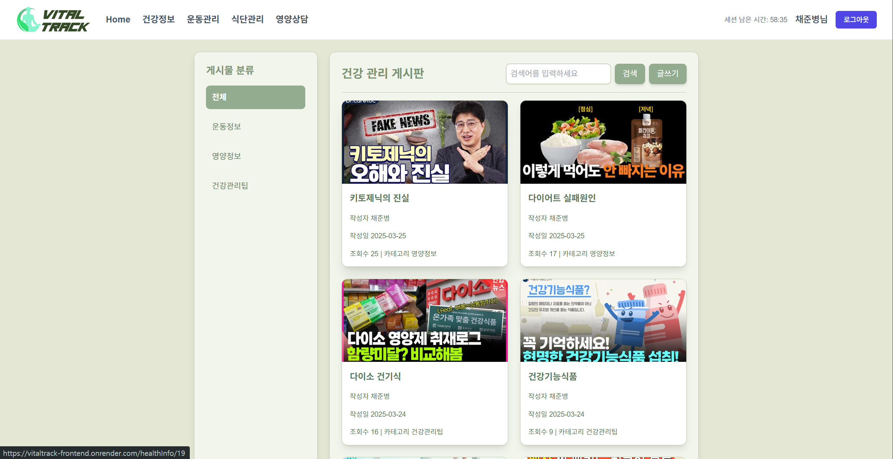

# VitalTrack

건강 관리의 필수 요소(체중·운동·식단·영양 상담)를 한 곳에서 추적하는 풀스택 웹 애플리케이션입니다.


**팀 구성:** 5인 (프론트엔드 2 · 백엔드 2 · 풀스택 1) · 2개월

---

## 라이브 데모

**배포 URL:** https://vitaltrack-frontend.onrender.com

| 구분 | ID | PW |
|------|----|----|
| 관리자 | `admin1` | `asdf1234` |
| 일반 사용자 | `Test1` | `asdf1234` |

> Render 무료 플랜 사용으로 첫 접속 시 30초 내외 로딩이 발생할 수 있습니다.

---

## 화면 구성

| 로그인 | 회원가입 |
|--------|----------|
|  |  |

| 대시보드 | 식단관리 |
|----------|----------|
|  |  |

| 운동관리 | 영양상담 게시판 |
|----------|----------------|
|  |  |

| 건강 관리 게시판 |
|-----------------|
|  |

---

## 나의 기여 (채준병)

팀 내에서 DevOps · PM · 프론트엔드 · 백엔드를 모두 담당했습니다.

### DevOps
- Docker Compose로 프론트엔드 / 백엔드 컨테이너 분리 구성
- Render 배포 및 `render.yaml` 작성, 환경변수 분리
- Railway → Aiven MySQL 무중단 마이그레이션

### PM & 설계
- 5인 팀 전체 2개월 일정 계획 및 진행 주도
- ERD 설계 및 테이블 정의서 문서화
- MyBatis XML 매퍼 쿼리 설계
- GitHub 브랜치 전략 수립 (feature 브랜치 분리)
- PR 병합 충돌 해결 및 코드 리뷰 주도
- 화면정의서 · API 문서 작성

### 프론트엔드
- **영양상담 게시판** 프론트엔드 전체 구현 (목록 / 작성 / 수정 / 상세 / 어드바이저)
- Quill → **Tiptap** 에디터 교체 (React 18 호환성 이슈 해결)
- 이미지 삽입 · 유튜브 링크 등 커스텀 에디터 기능 적용
- 댓글 작성 / 수정 / 삭제 기능
- 세션 만료 감지 → **Toastify** 알림 UI 개선

### 백엔드
- **JWT** 로그인 인증 및 Spring Security 설정 전체 구현
- **BCrypt** 비밀번호 암호화 적용
- Google OAuth 소셜 로그인 연동
- 회원가입 · 회원정보 수정 · 탈퇴 API
- 건강정보 자동 계산 (BMI · 권장 칼로리 · 영양소)
- 영양상담 · 건강정보 게시판 CRUD API
- 댓글 수정 시 작성자 권한 검증 로직

---

## 주요 구현 코드

### 1. JWT 인증 필터 (Spring Security)

매 요청마다 `Authorization: Bearer <token>` 헤더를 검사하여 유효한 토큰일 때만 `SecurityContext`에 인증 정보를 등록합니다.

```java
// back_end/src/main/java/com/vitaltrack/config/JwtAuthenticationFilter.java
public class JwtAuthenticationFilter extends OncePerRequestFilter {

  private final JwtUtil jwtUtil;

  @Override
  protected void doFilterInternal(HttpServletRequest request,
      HttpServletResponse response, FilterChain filterChain)
      throws ServletException, IOException {

    final String authHeader = request.getHeader("Authorization");

    if (authHeader != null && authHeader.startsWith("Bearer ")) {
      String jwt = authHeader.substring(7);
      if (jwtUtil.isTokenValid(jwt)) {
        String username = jwtUtil.extractUsername(jwt);
        UsernamePasswordAuthenticationToken authentication =
            new UsernamePasswordAuthenticationToken(username, null, Collections.emptyList());
        authentication.setDetails(new WebAuthenticationDetailsSource().buildDetails(request));
        SecurityContextHolder.getContext().setAuthentication(authentication);
      }
    }
    filterChain.doFilter(request, response);
  }
}
```

### 2. BCrypt 암호화 + 건강정보 자동 계산 (회원가입)

비밀번호를 암호화하기 전, 입력값 검증 → 중복 검사 → BMI · 권장 칼로리 · 영양소를 자동 계산하여 저장합니다.

```java
// back_end/src/main/java/com/vitaltrack/logic/MemberLogic.java
@Transactional
public int registerMember(MemberInfo member) {
  // 중복 검사
  if (memberDao.findByEmail(member.getMemEmail()) != null)
    throw new IllegalArgumentException("이미 존재하는 이메일입니다.");
  if (memberDao.existsById(member.getMemId()) > 0)
    throw new IllegalArgumentException("이미 존재하는 ID입니다.");

  // 건강 지표 자동 계산
  double bmi = calculateBMI(member.getMemHeight(), member.getMemWeight());
  int calorie = calculateCalories(member.getMemGen(), member.getMemAge(),
      member.getMemWeight(), member.getMemHeight());
  calculateStandardNutrition(member, calorie);
  member.setMemBmi(bmi);
  member.setMemKcal(calorie);

  // BCrypt 암호화 후 저장
  member.setMemPw(BCrypt.hashpw(member.getMemPw(), BCrypt.gensalt()));
  int result = memberDao.insertMember(member);

  if (result > 0 && member.getMemNo() != null)
    memberDao.insertOrUpdateWeightChange(member.getMemNo(),
        LocalDate.now().toString(), member.getMemWeight());

  return result;
}
```

### 3. 세션 만료 감지 → Toastify 알림 (React)

앱 진입 시 `localStorage`의 만료 시각을 확인하고, 중복 로그아웃을 방지하면서 사용자에게 토스트 알림을 표시합니다.

```jsx
// front_end/src/App.jsx
const performLogout = useCallback(() => {
  if (logoutHandled) return; // 중복 실행 방지
  setLogoutHandled(true);
  localStorage.removeItem('token');
  localStorage.removeItem('user');
  localStorage.removeItem('expiresAt');
  setUser(null);
  if (window.location.pathname !== '/login') navigate('/');
  toast.info('세션이 만료되어 로그아웃되었습니다.');
}, [logoutHandled, navigate]);

useEffect(() => {
  const expiresAt = localStorage.getItem('expiresAt');
  if (expiresAt && isSessionExpired()) {
    performLogout();
  }
}, [navigate, performLogout]);
```

### 4. Tiptap 에디터 — Quill 교체 (React 18 호환)

Quill이 React 18의 Strict Mode에서 이중 마운트 문제를 일으켜 Tiptap으로 교체했습니다. TextStyle을 확장해 커스텀 폰트 크기를 지원하고, 이미지를 서버에 업로드한 뒤 URL로 삽입합니다.

```jsx
// front_end/src/pages/counsel/CounselTiptapEditor.jsx
const FontSize = TextStyle.extend({
  addAttributes() {
    return {
      fontSize: {
        default: null,
        parseHTML: (element) => element.style.fontSize || null,
        renderHTML: (attributes) => {
          if (!attributes.fontSize) return {};
          return { style: `font-size: ${attributes.fontSize}` };
        }
      }
    };
  }
});

const addImage = async () => {
  const input = document.createElement('input');
  input.type = 'file';
  input.accept = 'image/*';
  input.onchange = async (event) => {
    const formData = new FormData();
    formData.append('image', event.target.files[0]);
    const res = await uploadImageDB(formData);
    if (res.data) {
      const url = `${process.env.REACT_APP_SPRING_IP}api/counsel/imageGet?imageName=${res.data}`;
      editor.chain().focus().setImage({ src: url }).run();
    }
  };
  input.click();
};
```

---

## 기술 스택

| 영역 | 기술 |
|------|------|
| 프론트엔드 | React 18, React Router, Tailwind CSS, Tiptap, Toastify |
| 백엔드 | Spring Boot 3, Spring Security, JWT, BCrypt, MyBatis |
| 데이터베이스 | MySQL (Aiven) |
| 인증 | JWT, Google OAuth 2.0 |
| 배포 | Docker, Render, Nginx |
| 협업 | GitHub (feature 브랜치), Notion, Slack |

---

## 트러블슈팅

`트러블슈팅.md` 파일에 주요 문제 해결 과정을 기록했습니다.

- **Quill → Tiptap 마이그레이션:** React 18 Strict Mode 이중 마운트로 인한 에디터 오작동 → Tiptap 교체 및 `useEffect` 의존성 정리
- **Railway → Aiven 마이그레이션:** DB 엔드포인트 교체 시 CORS 및 환경변수 동시 업데이트 필요
- **세션 중복 로그아웃:** `performLogout`이 여러 `useEffect`에서 동시에 호출되는 문제 → `logoutHandled` 플래그로 단일 실행 보장

---

## 프로젝트 구조

```
VitalTrack/
├── back_end/          # Spring Boot API 서버
│   └── src/main/java/com/vitaltrack/
│       ├── config/    # Security, JWT 필터
│       ├── controller/
│       ├── logic/     # 비즈니스 로직
│       ├── dao/       # MyBatis DAO
│       └── model/
├── front_end/         # React 클라이언트
│   └── src/
│       ├── pages/     # counsel / workout / diet / infoboard / auth
│       ├── components/
│       ├── contexts/
│       └── services/
├── docker-compose.yml
└── render.yaml
```
